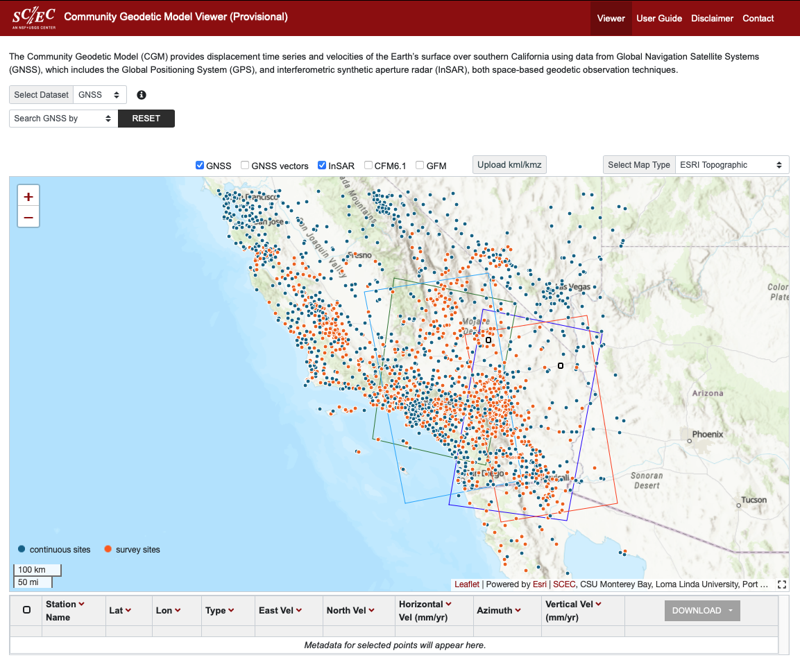

# CGM viewer

## Community Geodetic Model

A 2D viewer based on Leaflet, an open-source JavaScript library for interactive maps,
https://leafletjs.com, map data services from OpenStreetMap, https://www.openstreetmap.org,
OpenTopoMap, https://www.opentopomap.org and leaflet esri plugin,
https://esri.github.io/esri-leaflet, for Ersi basemap from ArcGIS and 2D time series plots
based on Plotly.js, a high-level delarative charting library.

## Community Geodetic Model

The Community Geodetic Model (CGM) provides displacement time series and velocities of the Earth’s surface over southern California using data from Global Navigation Satellite Systems (GNSS), which includes the Global Positioning System (GPS), and interferometric synthetic aperture radar (InSAR), both space-based geodetic observation techniques.

### https://www.scec.org/research/cgm

### Screen Capture

 

## CGM data service

Software stack at the backend server node when postgres and postgis are
being built from source:

- git
- gcc
- readline-develp
- zlib-devel
- json-c
- autoconf
- libxml2-devel
- libtool
- postgres version a10.5
 - proj5
 - gdal
- postgis version 2.5.1
- apache web server

Data preprocessing instructions are in doc/run-preprocess-data,

### Deployment

Deployment is accomplished using [Docker](https://docs.docker.com/) with [docker-compose]([https://docs.docker.com/compose/). Clone the git repository and run the commands below for development or production deployment.

#### Development Deployment
1. Run: `docker-compose -f docker-compose.yml -f development.yml up -d`
2. Run: `./load_insar.sh`
3. After the build is complete, browse to http://localhost:8084
4. The development.yml maps the code directory to the container for easy code development and exposes port 5432 for directly accessing the Postgres database.

#### Production Deployment
1. Run: `docker-compose -f docker-compose.yml up -d`
2. Run: `./load_insar.sh`
3. After build is complete, browse to http://server-name:8084
4. Optionally, set up a reverse proxy from a URL on an existing web server to localhost:8084.

### Layout 

Server Side 
       
    Postgres/Postgis database
    data files (Hosted on INSAR LOCATION???)
    PHP scripts for accessing database
    Apache web service to manage incoming
       and outgoing instruction/data

Client Side 

    JS scripts to process and manage data product
    Html web page for graphics display and user dashboard
